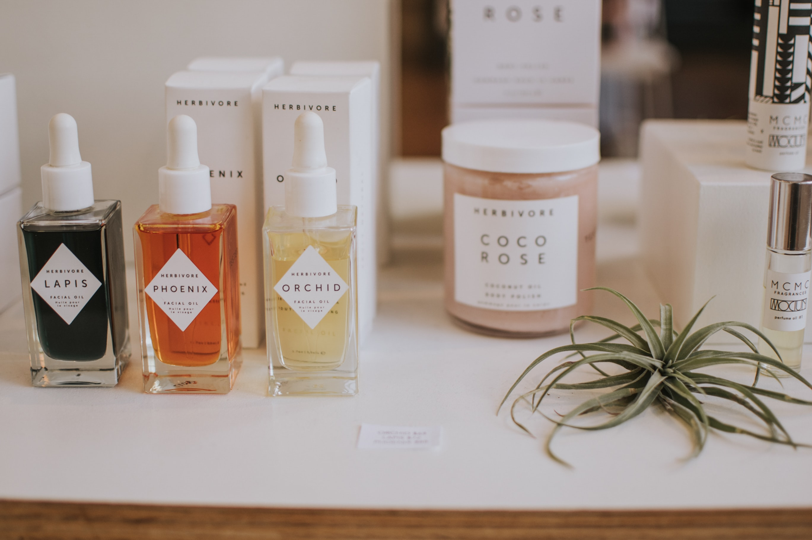

<!DOCTYPE html>
<html lang="en">

<head>
    <meta charset="utf-8" />
    <title>Tawoos</title>
    <meta name="viewport" content="width=device-width, initial-scale=1.0" />

 
    <link rel="shortcut icon"  href="img/logo/og.png">

    <link rel="stylesheet" type="text/css" href="css/bootstrap.min.css" />
    <link rel="stylesheet" type="text/css" href="css/font-awesome.min.css" />
    <link rel="stylesheet" type="text/css" href="css/magnific-popup.css" />
    <link rel="stylesheet" type="text/css" href="css/style.css" />
    <link rel="stylesheet" type="text/css" href="css/skins/yellow.css" />

    <!-- Revolution Slider CSS Files -->
    <link rel="stylesheet" type="text/css" href="js/plugins/revolution/css/settings.css" />
    <link rel="stylesheet" type="text/css" href="js/plugins/revolution/css/layers.css" />
    <link rel="stylesheet" type="text/css" href="js/plugins/revolution/css/navigation.css" />

    <!-- Live Style Switcher - demo only -->
    <link rel="alternate stylesheet" type="text/css" title="blue" href="css/skins/blue.css" />
    <link rel="alternate stylesheet" type="text/css" title="blueviolet" href="css/skins/blueviolet.css" />
    <link rel="alternate stylesheet" type="text/css" title="goldenrod" href="css/skins/goldenrod.css" />
    <link rel="alternate stylesheet" type="text/css" title="green" href="css/skins/green.css" />
    <link rel="alternate stylesheet" type="text/css" title="magenta" href="css/skins/magenta.css" />
    <link rel="alternate stylesheet" type="text/css" title="orange" href="css/skins/orange.css" />
    <link rel="alternate stylesheet" type="text/css" title="purple" href="css/skins/purple.css" />
    <link rel="alternate stylesheet" type="text/css" title="red" href="css/skins/red.css" />
    <link rel="alternate stylesheet" type="text/css" title="yellow" href="css/skins/yellow.css" />
    <link rel="alternate stylesheet" type="text/css" title="yellowgreen" href="css/skins/yellowgreen.css" />
    <link rel="stylesheet" type="text/css" href="css/styleswitcher.css" />

    <!-- Template JS Files -->
    

</head>

<body class="double-diagonal dark">
    <!-- Preloader Starts -->
    

        

            
        

        

    

    <!-- Preloader Ends -->
  
    <!-- Page Wrapper Starts -->
    

        <!-- Header Starts -->
        <header class="header">
            

                <!-- Navbar Starts -->
                <nav class="navbar">
                    <!-- Logo Starts -->
                    

                        <a data-toggle="collapse" data-target=".navbar-collapse.show" class="navbar-brand" href="index.html">
                       
                            
                            
                        </a>
                    

                    <!-- Logo Ends -->
					<!-- Toggle Icon for Mobile Starts -->
					<button class="navbar-toggle navbar-toggler" type="button" data-toggle="collapse" data-target=".navbar-collapse" aria-controls="navbarSupportedContent" aria-expanded="false" aria-label="Toggle navigation">
						
						  
						  
						  
						  
						
					</button>
					<!-- Toggle Icon for Mobile Ends -->
					

						<!-- Main Menu Starts -->
						<ul class="nav navbar-nav" id="main-navigation">
							<li class="active"><a href="index.html"><i class="fa fa-home"></i> Home</a></li>
							<li><a href="about.html"><i class="fa fa-user"></i> About Us</a></li>
							<!--<li class="dropdown">
								<a href="#" class="dropdown-toggle" data-toggle="dropdown"><i class="fa fa-image"></i> portfolio <i class="fa fa-angle-down icon-angle"></i></a>
								<ul class="dropdown-menu" role="menu">
									<li><a href="portfolio-2-columns.html">Portfolio 2 Columns</a></li>
									<li><a href="portfolio-3-columns.html">Portfolio 3 Columns</a></li>
									<li><a href="portfolio-4-columns.html">Portfolio 4 Columns</a></li>
									<li><a href="image-project.html">Image Project</a></li>
									<li><a href="slider-project.html">Slider Project</a></li>
									<li><a href="gallery-project.html">Gallery Project</a></li>
									<li><a href="video-project.html">Video project</a></li>
									<li><a href="youtube-project.html">youtube Project</a></li>
									<li><a href="vimeo-project.html">Vimeo Project</a></li>
								</ul>
							</li>
							<li class="dropdown">
								<a href="#" class="dropdown-toggle" data-toggle="dropdown"><i class="fa fa-edit"></i> Blog <i class="fa fa-angle-down icon-angle"></i></a>
								<ul class="dropdown-menu" role="menu">
									<li><a href="blog-right-sidebar.html">Right Sidebar</a></li>
									<li><a href="blog-left-sidebar.html">Left Sidebar</a></li>
									<li><a href="blog-grid-no-sidebar.html">Grid No Sidebar</a></li>
									<li><a href="blog-post.html">Single Post</a></li>
								</ul>
							</li>
							<li class="dropdown">
								<a href="#" class="dropdown-toggle" data-toggle="dropdown"><i class="fa fa-file-text-o"></i> pages <i class="fa fa-angle-down icon-angle"></i></a>
								<ul class="dropdown-menu" role="menu">
									<li><a href="register.html">Register page</a></li>
									<li><a href="login.html">Login page</a></li>
									<li><a href="pricing.html">Pricing</a></li>                                        
									<li><a href="shopping-cart.html">Shopping cart</a></li>
									<li><a href="shopping-checkout.html">shopping checkout</a></li>
									<li><a href="coming-soon.html">Coming Soon</a></li>
									<li><a href="404.html">404 Page</a></li>
									<li><a href="503.html">Server Error Page</a></li>
									<li><a href="faq.html">FAQ page</a></li>
									<li><a href="terms-of-services.html">Terms of Services</a></li>
								</ul>
							</li>-->
                            <li><a href="#product"><i class="fa fa-shopping-cart"></i> Our Product</a></li>
							<li><a href="contact.html"><i class="fa fa-envelope"></i> Contact</a></li>
							<!-- Cart Icon Starts -->
							
							<!-- Search Icon Ends -->
						</ul>
						<!-- Main Menu Ends -->
					

					
                    <!-- Navigation Menu Ends -->
                </nav>
                <!-- Navbar Ends -->
            

        </header>
        <!-- Header Ends -->
        <!-- Main Slider Section Starts -->
        <section class="mainslider" id="mainslider">
            <!-- Slider Hero Starts -->
            

                <!-- START REVOLUTION SLIDER 5.0.7 fullwidth mode -->
                

                    <ul>
                        <!-- SLIDE  -->
                        <li data-index="rs-18" data-transition="zoomin" data-slotamount="7" data-easein="Power4.easeInOut" data-easeout="Power4.easeInOut" data-masterspeed="2000" data-thumb="img/revolution-slider/kenburns/thumb1.jpg" data-rotate="0" data-saveperformance="off" data-title="Ken Burns" data-description="">
                            <!-- MAIN IMAGE -->
                            
                            <!-- LAYERS -->

                            <!-- LAYER NR. 1 -->
                            
THAWOOS GROUP
                            

                            <!-- LAYER NR. 2 -->
                            
We sell FRAGRANCE and ORGANIC PRODUCTS
                            

                            <!-- LAYER NR. 3 -->
                            
<i class="pe-7s-refresh"></i>
                            

                            <!-- LAYER NR. 4 -->
                            
<a href="#about" class="custom-button slider-button scroll-to-target">learn more about us</a>

                        </li>
                        <!-- SLIDE  -->
                        <li data-index="rs-2" data-transition="zoomin" data-slotamount="default" data-easein="default" data-easeout="default" data-masterspeed="default" data-thumb="img/revolution-slider/kenburns/thumb2.jpg" data-rotate="0" data-fsmasterspeed="300" data-fsslotamount="7" data-saveperformance="off" data-title="Intro" data-description="">
                            <!-- MAIN IMAGE -->
                            
                            <!-- LAYERS -->

                            <!-- LAYER NR. 1 -->
                            
SOLUTION TO  
FRAGRANCE

                            

                            <!-- LAYER NR. 2 -->
                            

                            

                            <!-- LAYER NR. 3 -->
                            
<i class="pe-7s-refresh"></i>
                            

                            <!-- LAYER NR. 4 -->
                            
<a href="#about" class="custom-button slider-button scroll-to-target">learn more about us</a>

                        </li>
                        <!-- SLIDE  -->
                        <li data-index="rs-3" data-transition="zoomin" data-slotamount="default" data-easein="default" data-easeout="default" data-masterspeed="default" data-thumb="img/revolution-slider/kenburns/thumb3.jpg" data-rotate="0" data-fsmasterspeed="300" data-fsslotamount="7" data-saveperformance="off" data-title="Intro" data-description="">
                            <!-- MAIN IMAGE -->
                            
                            <!-- LAYERS -->

                            <!-- LAYER NR. 1 -->
                            
FRESH FROM  
THE FARM

                            

                            <!-- LAYER NR. 2 -->
                            
   We deliver organic fruits & vegetables  fresh from our fields to your shops.
                            

                            <!-- LAYER NR. 3 -->
                            
<i class="pe-7s-refresh"></i>
                            

                            <!-- LAYER NR. 4 -->
                            
<a href="#about" class="custom-button slider-button scroll-to-target">learn more about us</a>

                        </li>
                    </ul>
                    

                    

                

            

            <!-- END REVOLUTION SLIDER -->
            <!-- Slider Hero Ends -->
        </section>
        <!-- Main Slider Section Ends -->
        <!-- About Section Starts -->
        <section id="about" class="about">
            <!-- Container Starts -->
            

                <!-- Main Heading Starts -->
                

                    <h1>About Us</h1>
                    <h4>Who We Are</h4>
                

                <!-- Main Heading Ends -->
                <!-- Divider Starts -->
                

                    
                    
                    
                

                <!-- Divider Ends -->
                <!-- About Content Starts -->
                

                    

                        <h3 class="title-about">WE ARE <strong>TAWOOS</strong></h3>
                        

                        

                            we are leading producers of FRAGRANCES items like perfume, bukhoor, etc and also we import branded perfumes, bukhoor , charcoal, and other products.
                        And we have also started to import ORGANIC PRODUCTS like Vegetables and fruits from various countries like India , etc.
                         

                        <!-- Tabs Heading Starts -->
                        <ul class="nav nav-tabs">
                            <li class="active"><a data-toggle="tab" href="#menu1">Our Mission</a></li>
                            <li><a data-toggle="tab" href="#menu2">Our advantages</a></li>
                            <li><a data-toggle="tab" href="#menu3">Our guarantees</a></li>
                        </ul>
                        <!-- Tabs Heading Ends -->
                        <!-- Tabs Content Starts -->
                        

                            

                                
To make people comfortable and satisfy with the products that we sell.  

                            

                            

                                
We only sell the products that are good for customers

                            

                            

                                
Buy anything from us and fell the satisfactor

                            

                        

                        <!-- Tabs Content Ends -->
                        <a class="custom-button" href="about.html">Learn more about us</a>
                    

                    

                        

                            
                            

                                <h3>Why <strong>Choose Us</strong></h3>
                                <ul class="list-why-choose-us">
                                    <li>Delivery</li>
                                    <li>Keepup with stocks</li>
                                    <li>Credit</li>
                                 
                                    <li>& Much More ...</li>
                                </ul>
                            

                        

                    

                

                <!-- About Content Ends -->
            

            <!-- Container Ends -->
        </section>
        <!-- About Section Ends -->
        <section id="product" class="about">
            <!-- Container Starts -->
            

                <!-- Main Heading Starts -->
                

                    <h1>Our Products</h1>
                    <h4>What we sell</h4>
                

                <!-- Main Heading Ends -->
                <!-- Divider Starts -->
                

                    
                    
                    
                

                <!-- Divider Ends -->
                <!-- About Content Starts -->
                

                    

                        

                            <h4>FRAGRANCES</h4>
                            
                            

                               
                            

                        

                    

                    

                        

                            <h4>ORGANIC PRODUCTS</h4>
                            
                            

                               
                            

                        

                    

                

                <!-- About Content Ends -->
            

            <!-- Container Ends -->
        </section>
        <!-- Services Section Starts -->
        <section class="services">
            <!-- Container Starts -->
            

                <!-- Main Heading Starts -->
                

                    <h1>Our Services</h1>
                    <h4>What We Doing</h4>
                

                <!-- Main Heading Starts -->
                <!-- Divider Starts -->
                

                    
                    
                    
                

                <!-- Divider Ends -->
                <!-- Services Starts -->
                

                    <!-- Service Item Starts -->
                    

                        <!-- Service Item Cover Starts -->
                        
                        <!-- Service Item Cover Ends -->
                        <!-- Service Item Content Starts -->
                        

                            <h2>Delivery</h2>
                            
 We provide shop delivery for all product for  your order     

                        

                        <!-- Service Item Content Ends -->
                    

                    <!-- Service Item Ends -->

                    <!-- Service Item Starts -->
                    

                        <!-- Service Item Cover Starts -->
                        
                        <!-- Service Item Cover Ends -->
                        <!-- Service Item Content Starts -->
                        

                            <h2>Sales Man </h2>
                            
Our sales man we will be visting your shop and taking the order from you.    

                        

                        <!-- Service Item Content Ends -->
                    

                    <!-- Service Item Ends -->

                    <!-- Service Item Starts -->
                    

                        <!-- Service Item Cover Starts -->
                        
                        <!-- Service Item Cover Ends -->
                        <!-- Service Item Content Starts -->
                        

                            <h2>Credit</h2>
                            
Provision for credit purchase, you make credit purchase which you pay later    

                        

                        <!-- Service Item Content Ends -->
                    

                    <!-- Service Item Ends -->

                   
                    <!-- Service Item Ends -->

                

                <!-- Services Ends -->
            

        </section>
        <!-- Services Section Ends -->
        <!-- Testimonials Section Starts -->
        <section class="testimonials">
            

                <!-- Container Starts -->
                

                    <!-- Main Heading Starts -->
                    

                        <h1>Happy Customers</h1>
                        <h4>Testimonials</h4>
                    

                    <!-- Main Heading Starts -->
                    <!-- Blockquotes Starts -->
                    

                        <!-- Wrapper For Sliders Starts -->
                        <!-- Indicators Starts -->
                        <ol class="carousel-indicators">
                            <li data-target="#quote-carousel" data-slide-to="0" class="active"></li>
                            <li data-target="#quote-carousel" data-slide-to="1"></li>
                            <li data-target="#quote-carousel" data-slide-to="2"></li>
                        </ol>
                        <!-- Indicators Ends -->
                        

                            <!-- Quote #1 Starts -->
                            

                                <blockquote>
                                    
                                    
Lorem ipsum dolor sit amet, consectetur adipiscing elit, sed do eiu nt ut labore et dolore magna aliqua. Ut enim ad minim veniam, quis nostrud exercitation ullamco laboris nisi ut aliquip ex ea commodo consequat. Duis aute irure dolor in reprehenderit in voluptat

                                    <h5>Miss Elina Pool</h5>
                                    <h6>Developer - Adobe</h6>
                                </blockquote>
                            

                            <!-- Quote #1 Ends -->
                            <!-- Quote #2 Starts -->
                            

                                <blockquote>
                                    
                                    
Sed do eiusmod tempor incididunt ut labore et dolore magna aliqua. Ut enim ad minim veniam, quis nostrud exercitation ullamco laboris nisi ut aliquip ex ea commodo consequat. Duis aute irure dolor in reprehenderit in voluptate velit esse cillum dolore eu

                                    <h5>Mr. Antoine Varane</h5>
                                    <h6>Manager - Twitter</h6>
                                </blockquote>
                            

                            <!-- Quote #2 Ends -->
                            <!-- Quote #3 Starts -->
                            

                                <blockquote>
                                    
                                    
Consectetur adipiscing elit, sed do eiusmod tempor incididunt ut labore et dolore magna aliqua. Ut enim ad minim veniam, quis nostrud exercitation ullamco laboris nisi ut aliquip ex ea commodo consequat. Duis aute irure dolor in reprehenderit in voluptate velit ess

                                    <h5>Miss Lucy Walker</h5>
                                    <h6>Manager - Envato</h6>
                                </blockquote>
                            

                            <!-- Quote #3 Ends -->
                        

                        <!-- Wrapper For Sliders Ends -->
                    

                    <!-- Blockquotes Ends -->
                

                <!-- Container Ends -->
            

        </section>
        <!-- Testimonials Section Ends -->
        
        <!-- Pricing Starts -->
        
        <!-- Pricing Ends -->
        <!-- Newsletter Section Starts -->
        <section class="newsletter">
            

                <!-- Container Starts -->
                

                    <!-- Main Heading Starts -->
                    

                        <h1>our newsletter</h1>
                        <h4>Keep in touch</h4>
                    

                    <!-- Main Heading Ends -->
                    

                        
To our newsletter subscription and be the first to know about  Important news  &  Amazing offers  & Discounts

                        <!-- Newsletter Form Starts -->
                        <form class="form-inputs">
                            <!-- Newsletter Form Input Field Starts -->
                            

                                
									<input placeholder="Enter Your Email" class="input-field custom-input-field" type="text" />
									<label class="input-label custom-input-label" >
										<i class="fa fa-envelope-open-o icon icon-field"></i>
									</label>
								
                            

                            <!-- Newsletter Form Input Field Ends -->
                            <!-- Newsletter Form Submit Button Starts -->
                            <button id="submit" name="submit" type="submit" class="custom-button" title="Send">Subscribe Now</button>
                            <!-- Newsletter Form Submit Button Ends -->
                        </form>
                        <!-- Newsletter Form Ends -->
                    

                

                <!-- Container Ends -->
            

        </section>
        <!-- Newsletter Section Ends -->
        
        <!-- Blog Section Ends -->
        <!-- Call To Action Section Starts -->
      
        <!-- facts Section Ends -->
        <!-- Logos Section Starts -->
   
        <!-- Logos Section Ends -->
        <!-- Footer Section Starts -->
        <footer class="footer top-logos">
            <!-- Footer Top Area Starts -->
            

                

                    <!-- Footer Widget Starts -->
                    

                        <h4>Tawoos</h4>
                        

                            <ul>
                                <li><a href="index.html">Home</a></li>
                                <li><a href="about.html">About</a></li>
                               <!-- <li><a href="pricing.html">pricing</a></li>
								<li><a href="portfolio-3-columns.html">portfolio</a></li>
                                <li><a href="blog-right-sidebar.html">Blog</a></li> -->
                            </ul>
                        

                    

                    <!-- Footer Widget Ends -->
                    <!-- Footer Widget Starts -->
                    

                        <h4>Support</h4>
                        

                            <ul>
								<li><a href="contact.html">Contact</a></li>
                               <!-- <li><a href="faq.html">FAQ</a></li>
                                <li><a href="terms-of-services.html">Terms of Services</a></li>
                                <li><a href="register.html">Register</a></li>
                                <li><a href="login.html">Login</a></li> -->
                            </ul>
                        

                    

                    <!-- Footer Widget Ends -->
                    <!-- Footer Widget Starts -->
                    

                        <h4>Contact US</h4>
                        

                            <ul>
                                <li><a href="tawoostrading@gmail.com"><i class="fa fa-envelope-open"></i> tawoostrading@gmail.com</a></li>
                                <li><a href="tel:33783831"><i class="fa fa-phone"></i>+97433783831</a></li>
                                <li><i class="fa fa-map-marker"></i> Qatar</li>
                                
                            </ul>
                        

                    

                    <!-- Footer Widget Ends -->
                    <!-- Footer Widget Starts -->
                    

                        <!-- Facts Starts -->
                        
                        <!-- Facts Ends -->
                        
                        <!-- Social Media Links Starts -->
                        

                            <ul class="social">
                                <li>
                                    
                                </li>
                                <li>
                                    
                                </li>
                                <li>
                                    
                                </li>
                                <li>
                                    
                                </li>
                                <li>
                                    
                                </li>
                            </ul>
                        

                        <!-- Social Media Links Ends -->
                    

                    <!-- Footer Widget Ends -->
                

                <!-- Footer Bottom Area Starts -->
                

                    

                        

                            <!-- Copyright Text Starts -->
                            
Copyright © 2020 Tawoos All Rights Reserved | Created with Love by U R TrapPed Creations

                            <!-- Copyright Text Ends -->
                        

                    

                

                <!-- Footer Bottom Area Ends -->
            

            <!-- Footer Top Area Ends -->

        </footer>
        <!-- Footer Section Ends -->
        <!-- Back To Top Starts -->
        

            

                <a href="#top"></a>
            

        

        <!-- Back To Top Ends -->
    

    <!-- Wrapper Ends -->

    <!-- Template JS Files -->
    
    
    
    
    
    

    <!-- Revolution Slider Main JS Files -->
    
    

    <!-- Revolution Slider Extensions -->

    
    
    
    
    
    
    
    
    

    <!-- Live Style Switcher JS File - only demo -->
    

    <!-- Main JS Initialization File -->
    
	
</body>

<!-- Mirrored from slimhamdi.net/amira/demos/index.html by HTTrack Website Copier/3.x [XR&CO'2014], Fri, 08 May 2020 09:40:25 GMT -->
</html>
